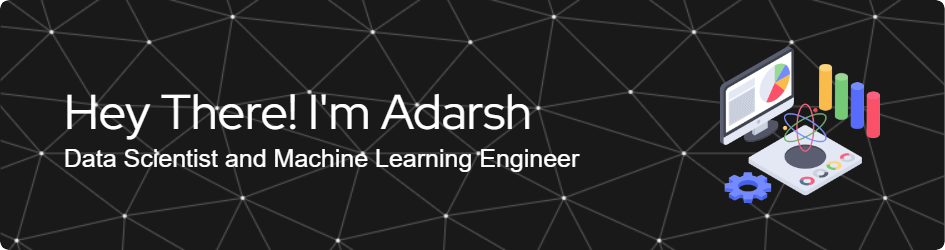

I'm a passionate Data Scientist 📊 and Machine Learning Engineer 🤖 always on the lookout for innovative solutiions to real-world problems. I sometimes work with Blockchain 🔗 as well! I have a robust background in Research 📝 Technology amazes and I'm commited to pushing the boundaries of leveraging it. Continously engaged in Projects 🛠️ or Learning 📚

---
 

---

- 🔭 I’m currently learning ... *NodeJS*🍀
- 🗂️ Looking to collaborate on ... *Any Data Science, Machine Learning or AI Based Project*
- ⚙️ Primarly work with ... *Python, C++, R and Now ... JavaScript*
- 💬 Ask me about ... *Data Science or Machine Learning or even AI in general*
- 📫 You can reach me at ... *[My Email](shailendraadarsh2@gmail.com) or [My LinkedIn](https://www.linkedin.com/in/adarshshailendra/)*
- ⚡ Fun fact ... *I make Scale Models of different Aircrafts ✈️ and Tanks* 🎖️
---

